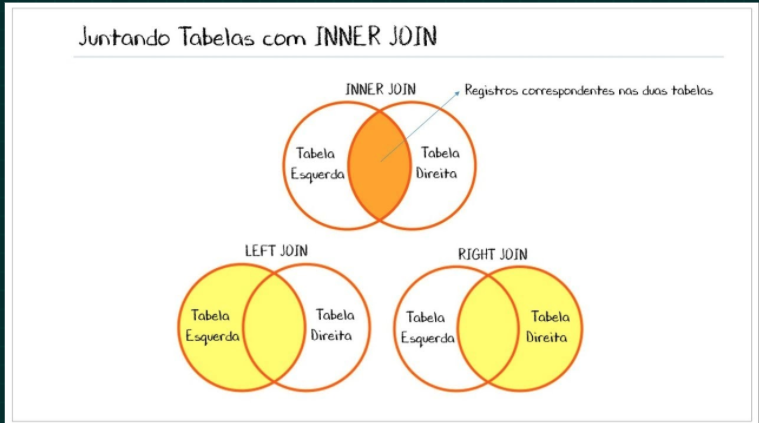

---
presentation:
  width: 1920
  height: 1080
  theme: black.css
  previewLinks: true
---

<!-- slide -->
# 21.2 - Join, Subqueries e UNION

<!-- slide vertical=true -->

## O que vamos aprender?

* Enteder como funcionar os diferentes tipo de JOIN
* Fazer queries usando subqueries
* Como utilizar o UNION e UNION ALL

<!-- slide -->

## JOIN

Usamos o JOIN para quando queremos trazer dados espalhados em várias tabelas de uma vez só



<!-- slide vertical=true -->

### [🤔 Dúvidas 🤔](https://wall.sli.do/event/cxcnx0en?section=f7e1666b-f6f6-4b7c-9572-1b90f5b0a1af)

<!-- slide -->

## SELF JOIN

```SQL
SELECT tabelaA.coluna1, tabelaB.coluna2
FROM tabelaA, tabelaB
WHERE tabelaA.coluna1 = tabelaB.coluna2
```

<!-- slide vertical=true -->

### [🤔 Dúvidas 🤔](https://wall.sli.do/event/cxcnx0en?section=f7e1666b-f6f6-4b7c-9572-1b90f5b0a1af)

<!-- slide -->

### Subqueries

Serve para quando queremos fazer uma operação baseado no resultado de outra query.

<!-- slide vertical=true -->

### [🤔 Dúvidas 🤔](https://wall.sli.do/event/cxcnx0en?section=f7e1666b-f6f6-4b7c-9572-1b90f5b0a1af)

<!-- slide -->

### Exists

Serve como um recurso para fazer uma filtragem de uma tabela usando uma subquery.

<!-- slide vertical=true -->

### [🤔 Dúvidas 🤔](https://wall.sli.do/event/cxcnx0en?section=f7e1666b-f6f6-4b7c-9572-1b90f5b0a1af)

<!-- slide -->

### UNION e UNION All

UNION => Une tirando os valores repetidos
UNION ALL => Une tirando os valores repetidos

<!-- slide vertical=true -->

### [🤔 Dúvidas 🤔](https://wall.sli.do/event/cxcnx0en?section=f7e1666b-f6f6-4b7c-9572-1b90f5b0a1af)


