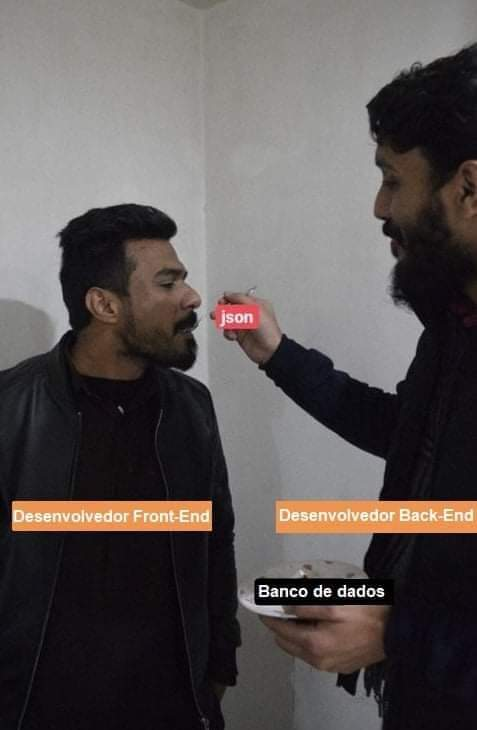

---
presentation:
  width: 1920
  height: 1080
  theme: white.css
  previewLinks: true
---
<!-- slide -->

# BLOCO 23 DIA 2 - Operadores de filtros (Filter Operators)

<!-- slide vertical=true -->

## O que vamos aprender hoje

* Como exportar/importar um `dump` do mongo
* Ordenação e contagem
* Operadores de comparação: `$lt`, `$lte`, `$gt`, `$gte` `$eq`, `$ne`, `$in` e `$nin`;
* Operadores lógicos: `$not`, `$nor`, `$and` e `$or`;
* Operadores de elementos: `$exists`.
* Remover documentos, coleção e banco de dados:  `deleteOne`, `deleteMany`, `db.collection.drop` e `db.dropDatabase()`.

<!-- slide -->

## Antes de tudo

<!-- slide vertical=true -->

### Frontend x Backend x Banco de dados

)

<!-- slide vertical=true -->

### Mongo + Node

```js
const { ObjectId } = require('mongodb');
const connection = require('./connection');

const findByName = async (name) =>
  connection()
    .then((db) => db.collection('products').findOne({ name }));

const findById = async (id) => {
  if (!ObjectId.isValid(id)) return null;

  return connection()
    .then((db) => db.collection('products').findOne(ObjectId(id)));
};

const addProduct = async (name, quantity) => {
  const result = await connection()
    .then((db) => db.collection('products').insertOne({ name, quantity }));
  return result.ops[0];
};
```

<!-- slide -->

## Como exportar/importar um `dump` do mongo

*Obs: Esses comandos devem ser executados fora do mongoshell*

```bash
# exportar um dump
mongodump --db=test --out=/data/backup/

# importar um dump
mongoimport --db comics --collection superheroes <caminho_do_arquivo>

mongo [database] <file>.json
```

[Documentação sobre mongodump e mongorestore](https://docs.mongodb.com/manual/tutorial/backup-and-restore-tools/)

<!-- slide vertical=true -->

# [🤔 Dúvidas 🤔](https://wall.sli.do/event/qhnczoyv?section=ab62bfef-7c26-45ab-9c5d-d6a3c7e62f74)

<!-- slide -->

## Ordenação e contagem

```js
db.filmes.find({ }).sort( { ano : 1 } ) // order by ano asc
db.filmes.find({ }).sort( { ano : -1 } ) // order by ano desc

db.filmes.count(); // ou
db.filmes.find().count();
```

<!-- slide vertical=true -->

# [🤔 Dúvidas 🤔](https://wall.sli.do/event/qhnczoyv?section=ab62bfef-7c26-45ab-9c5d-d6a3c7e62f74)

<!-- slide -->

## Operadores de comparação

**Operador `$lt` (less than) e `$lte` (less than or equal to)**

```js
db.filmes.find({ ano: { $lt: 2000 } }); 
db.filmes.find({ ano: { $lte: 2000 } });
```

<!-- slide vertical=true -->

**Operador `$gt` (great than) e `$gte` (great than or equal to)**

```js
db.filmes.find({ ano: { $gt: 2010 } }); 
db.filmes.find({ ano: { $gte: 2010 } });
```

<!-- slide vertical=true -->

**Combinando os dois operadores (BETWEEN)**

```js
db.filmes.find(
    { ano: { $gte: 1993, $lte: 2000 } }
).pretty();
```

<!-- slide vertical=true -->

**Operador `$eq` (equal) e `$ne` (not equal)**

```js
db.filmes.find({ ano: { $eq: 1993 } }); // ou 
db.filmes.find({ ano: 1993 });

db.filmes.find({ "avaliacao.bom": { $eq: 7 } }); // ou
db.filmes.find({ "avaliacao.bom": 7 });

db.filmes.find({ "avaliacao.ruim": { $ne: 8 } });

// como usar like
db.filmes.find({titulo: /a/})  //like '%a%'
db.filmes.find({titulo: /^pa/}) //like 'pa%' 
db.filmes.find({titulo: /ro$/}) //like '%ro'
```

<!-- slide vertical=true -->

**Operador `$in` e `$nin` (not in)**

```js
// $in
db.filmes.find({ ano: { $in: [2001, 1968, 1995] } }).pretty();

// $nin
db.filmes.find({ ano: { $nin: [2013, 2008] } });
```

<!-- slide vertical=true -->

# [🤔 Dúvidas 🤔](https://wall.sli.do/event/qhnczoyv?section=ab62bfef-7c26-45ab-9c5d-d6a3c7e62f74)


<!-- slide -->

## Operadores lógicos

<!-- slide vertical=true -->

**Operadores `$and` e `$or`** 

```js
// $and
db.filmes.find({ $and: [{ ano: { $gt:2000 } }, { "avaliacao.bom": { $gte: 8 } }] });

// $or
db.filmes.find({ $or: [{ ano: { $gt:2000 } }, { "avaliacao.bom": { $gte: 8 } }] });
```

<!-- slide vertical=true -->

**Operadores `$not` e `$nor`** 

```js
db.filmes.find({ano: {
  $not: {$gte: 2000}}
});

db.filmes.find({$nor: [
  { ano: { $lt: 2020 } }, 
  { "avaliacao.bom": { $lt: 7 } }
]);

// equivalente a 
db.filmes.find({$or: [
  { ano: { $gte: 2020 } }, 
  { "avaliacao.bom": { $gte: 7 } }
]);
```

<!-- slide vertical=true -->

### Operador lógico `$nor`


<!-- slide vertical=true -->

# [🤔 Dúvidas 🤔](https://wall.sli.do/event/qhnczoyv?section=ab62bfef-7c26-45ab-9c5d-d6a3c7e62f74)


<!-- slide -->

### Pausa


<!-- slide -->

## Operadores de elementos

<!-- slide vertical=true -->

**Operador `$exists`**

```js
db.records.insertMany(
    [
        { primeiro: 5, segundo: 5, terceiro: null },
        { primeiro: 3, segundo: null, terceiro: 8 },
        { primeiro: null, segundo: 3, terceiro: 9 },
        { primeiro: 1, segundo: 2, terceiro: 3 },
        { primeiro: 2, terceiro: 5 },
        { primeiro: 3, segundo: 2 },
        { primeiro: 4 },
        { segundo: 2, terceiro: 4 },
        { segundo: 2 },
        { terceiro: 6 }
    ]
);

// $exists: true
db.records.find({ primeiro: { $exists: true } });
// $exists: false
db.records.find({ segundo: { $exists: false } });
```

<!-- slide vertical=true -->

# [🤔 Dúvidas 🤔](https://wall.sli.do/event/qhnczoyv?section=ab62bfef-7c26-45ab-9c5d-d6a3c7e62f74)

<!-- slide -->

## Removendo documentos, coleções e banco de dados

<!-- slide vertical=true -->

**Método `deleteOne()`**

```js
db.filmes.deleteOne({}); // remove o primeiro elemento.
db.filmes.deleteOne({ titulo: "Os Oito Odiados" });
```

<!-- slide vertical=true -->

**Método `deleteMany()`**

```js
db.filmes.deleteMany({ "avaliacao.ruim": { $gt:6 }}); 
db.filmes.deleteMany({}); // remove todos
```

<!-- slide vertical=true -->

# [🤔 Dúvidas 🤔](https://wall.sli.do/event/qhnczoyv?section=ab62bfef-7c26-45ab-9c5d-d6a3c7e62f74)

<!-- slide vertical=true -->

**Método `db.collection.drop` e `db.dropDatabase()`**

```js
db.records.drop();
db.dropDatabase();
```

<!-- slide vertical=true -->

# [🤔 Dúvidas 🤔](https://wall.sli.do/event/qhnczoyv?section=ab62bfef-7c26-45ab-9c5d-d6a3c7e62f74)

